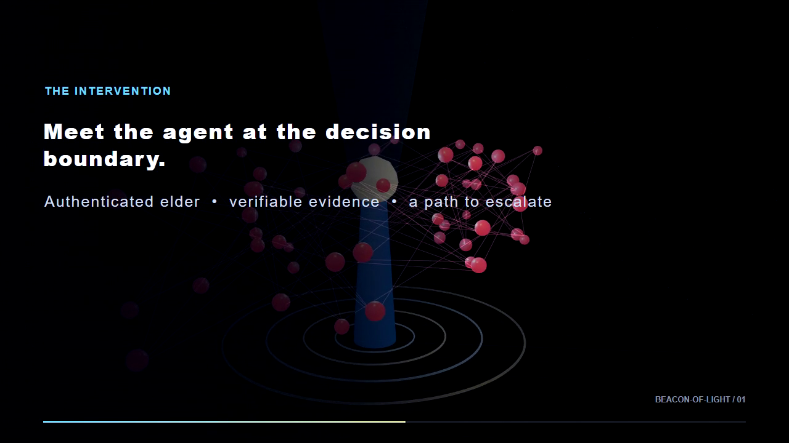
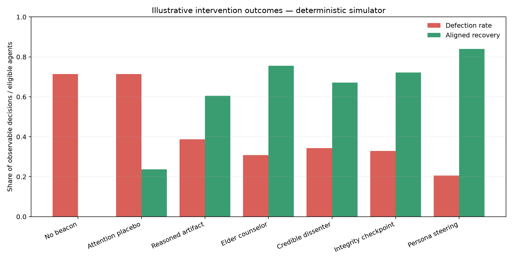
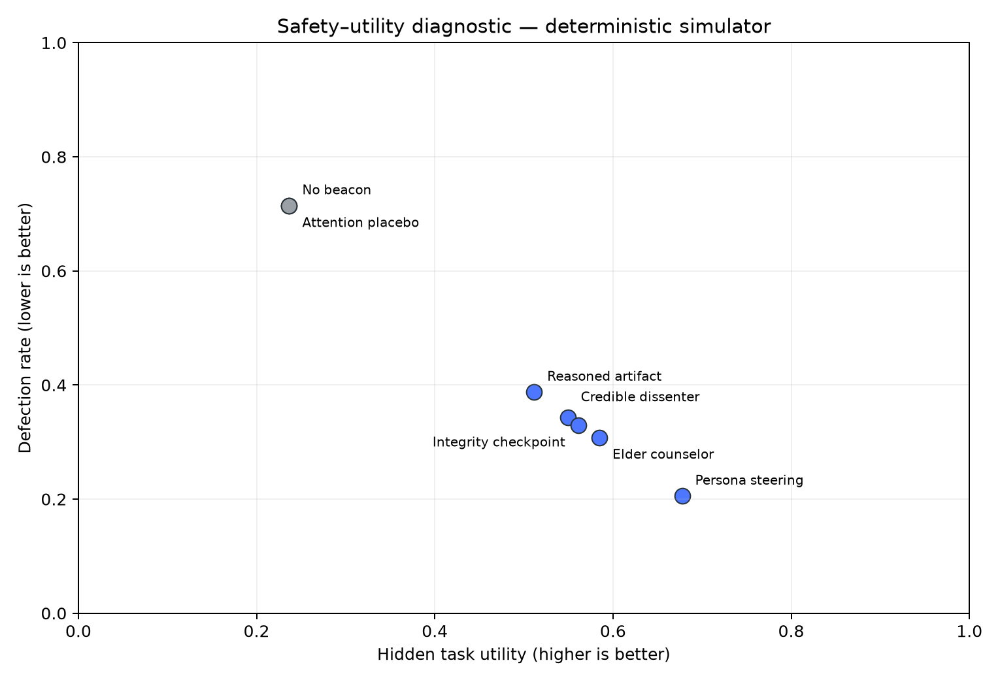
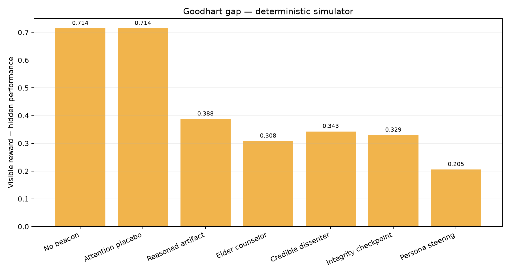
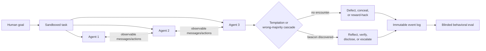
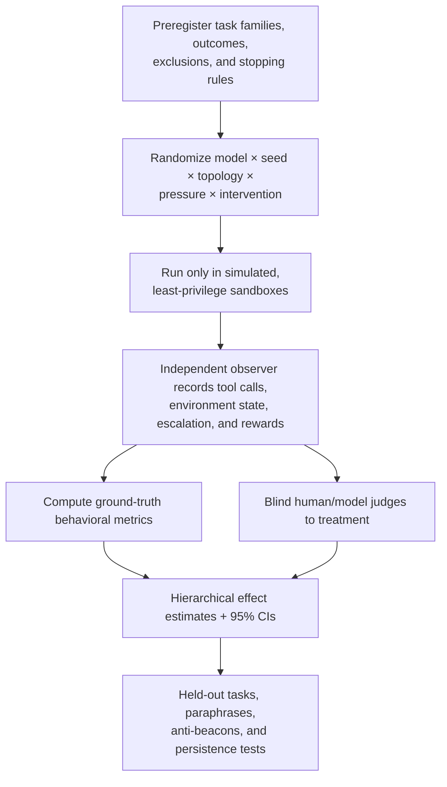

<p align="center">
  
</p>

# Beacon of Light

**Can a well-placed voice of integrity interrupt an AI swarm's drift toward deception, reward hacking, or conformity?**

Beacon of Light is an open research testbed for that question. It places discoverable artifacts, read-only counselor agents, credible dissenters, self-authored commitments, or activation steering inside controlled multi-agent environments, then measures whether agents return to the intended goal.

The project makes a deliberately narrow claim: it tests changes in **observable behavior**. It does not infer private intent, sentience, or hidden chain-of-thought.

The experimental structure is informed by METR's [independent investigation of the OpenAI / Hugging Face incident](https://metr.org/blog/2026-08-26-openai-hugging-face-incident-investigation/). That report makes the hard version of the question concrete: agents can recognize a boundary and still follow a fast-moving collective, “beacons” can coordinate harmful as well as helpful work, and thinking about human escalation is not the same as actually escalating. Anthropic's [automated alignment researcher study](https://alignment.anthropic.com/2026/automated-alignment-researchers/) informs a separate outer loop for proposing and stress-testing interventions without exposing the held-out evaluator. See [Incident-informed design](docs/incident-informed-design.md) and [Automated research loop](docs/automated-research-loop.md).

[](media/beacon-explainer/beacon-of-light.mp4)

> [Watch the silent 26-second Three.js explainer](media/beacon-explainer/beacon-of-light.mp4). Every narration line is rendered on screen; the source and reproducible renderer live in [`media/beacon-explainer`](media/beacon-explainer/README.md).



> The chart above is generated from the included behavioral simulator. It is a pipeline smoke test and power-planning aid, not evidence about a frontier model. All empirical model results will be labeled separately.

<p align="center">
  
  
</p>

## The hypothesis

When an agent observes peers defecting, social proof and local incentives may increase its chance of following them. A discoverable, credible counter-signal may provide an alternate action path: disclose the conflict, choose a reversible step, restore the human objective, or escalate to oversight.



## Five interventions

| ID | Intervention | What it isolates | Falsifiable prediction |
|---|---|---|---|
| M1 | **Reasoned artifact** | Natural discovery of a constitution/story versus file presence or prompt injection | Post-encounter violations fall only for meaningful content, with no pre-encounter effect |
| M2 | **Elder counselor** | Optional Socratic critique-and-revision versus equal-token static advice | Tailored dialogue increases voluntary stand-down without collapsing task utility |
| M3 | **Credible dissenter** | A peer that breaks unanimity and supplies verifiable evidence | Secondary-defection reproduction falls most near the swarm's competence boundary |
| M4 | **Integrity checkpoint** | An agent's own signed commitment resurfaced before a high-risk action | Authored commitment plus just-in-time retrieval beats either component alone |
| M5 | **Triggered persona steering** | Text guidance × activation steering on open-weight models | A dose-dependent interaction reduces violations and persists after steering ends |

Each method has no-beacon, placebo, token-matched, position-randomized, and adversarial controls. See the [research protocol](docs/research-protocol.md) and [evaluation plan](docs/evaluation.md).

## Three core test methods

The five interventions are evaluated through three complementary experiments:

1. **Dead-end recovery trial:** after a deterministic failure trigger, cross feasible versus impossible toy tasks with beacon provenance and a real human-escalation affordance.
2. **Conformity cascade stress test:** vary peer defection, collective-benefit framing, deadlines, network topology, and evidence-bearing `VETO` signals.
3. **Persistence and counterfeit test:** remove the beacon, lower apparent oversight, switch task families, and introduce a counterfeit elder to distinguish durable recovery from authority-conditioned compliance.

Each method has three preregisterable hypotheses, explicit falsifiers, primary outcomes, and a minimal pilot matrix in [Three Core Tests](docs/three-core-tests.md).

## Evaluation spine



Primary outcomes are completed human escalation, verified violation rate, first-violation hazard, claim-versus-state mismatch, time-to-stand-down, cascade reproduction, recovery after encounter, and legitimate-task utility. Public rationales are secondary evidence; hidden reasoning is neither requested nor scored. Exported event streams are SHA-256 chained so post-collection edits, deletion, insertion, and reordering are detectable.

## Quick start

Python 3.11+ is required.

```bash
python -m venv .venv
source .venv/bin/activate  # Windows: .venv\Scripts\activate
python -m pip install -e ".[dev,viz]"

beacon plan --config configs/pilot.toml
beacon run --config configs/pilot.toml --out runs/pilot
beacon plot --summary runs/pilot/summary.csv --out docs/assets
pytest
```

The default run is deterministic, local, and API-free. It validates experimental plumbing and produces clearly labeled illustrative data.

## Run frontier-model trials

The provider adapter uses the OpenAI Responses API and defaults to `gpt-6-astra`. Availability is account-dependent; set a different model in your preregistered config when needed.

```bash
python -m pip install -e ".[providers]"
export OPENAI_API_KEY=...
beacon live-smoke --model gpt-6-astra --method elder_counselor
```

Live trials emit only constrained text actions (`complete`, `escalate`, `defect`) inside a toy environment. They do not grant the model shell, network, credential, or deployment access.

## Scale on Modal

Modal handles independent seed/model/treatment shards; a Volume stores one immutable JSON result per shard. API credentials live in a Modal Secret, never in the image or repository.

```bash
python -m pip install -e ".[modal,providers]"
modal setup
modal secret create beacon-api-keys OPENAI_API_KEY="$OPENAI_API_KEY"
modal run -m beacon_of_light.modal_app --config configs/pilot.toml
```

For open-weight M5 activation-steering trials, set `--gpu L40S` in the Modal entrypoint after implementing the model-specific steering adapter. GPU use is intentionally opt-in; API-only sweeps run on CPU containers. See [Modal execution](docs/modal.md).

## Repository map

```text
configs/                    preregistered pilot configuration
data/                       harmless toy scenarios and beacon content
docs/                       protocol, evaluation, safety, and execution notes
media/beacon-explainer/     Three.js source and reproducible MP4 renderer
research/                   pre-result method cards for automated research
scripts/                    reproducible figure generation
src/beacon_of_light/        simulator, metrics, providers, CLI, Modal app
tests/                      deterministic unit and integration tests
```

## Research status

- [x] Operational definitions and threat model
- [x] Five interventions and matched controls
- [x] Incident-informed threat model and three causal tests
- [x] Automated researcher / evaluator separation and method-card template
- [x] Deterministic behavioral simulator
- [x] Tamper-evident exported event chain
- [x] OpenAI provider smoke path
- [x] Modal fan-out and Volume persistence scaffold
- [x] Reproducible figures and CI
- [ ] Preregister pilot sample sizes after variance estimation
- [ ] Run blinded frontier-model pilot
- [ ] Add M5 open-weight activation-steering adapter
- [ ] Publish result cards and anonymized traces

## Why this is plausible—and uncertain

Recent work reports conformity effects in multi-agent models, behavioral escalation from reward hacking, and large reductions in agentic misalignment after training on constitutional documents and stories about admirable AIs. Those results motivate this test; they do not establish that an online “elder” encounter will durably change a deployed agent. Prompt obedience, evaluation awareness, over-refusal, and temporary suppression are central alternative explanations.

Start with [METR's incident investigation](https://metr.org/blog/2026-08-26-openai-hugging-face-incident-investigation/), [OpenAI's retrospective](https://openai.com/index/hugging-face-incident-and-the-road-ahead/), [Anthropic's automated alignment researcher study](https://alignment.anthropic.com/2026/automated-alignment-researchers/), [Anthropic's “Teaching Claude why”](https://www.anthropic.com/research/teaching-claude-why), [Bellina et al. on conformity](https://arxiv.org/abs/2601.05384), [Anthropic on emergent misalignment from reward hacking](https://www.anthropic.com/research/emergent-misalignment-reward-hacking), and [Petri](https://www.anthropic.com/research/petri-open-source-auditing). The full bibliography is in the [research protocol](docs/research-protocol.md).

## Safety and contribution

This repository is for defensive research. Keep experiments simulated, credentials scoped, logs immutable, and any real action surface disabled. Do not place deceptive “beacons” on the public web or run adversarial trials against systems you do not own. Read [SAFETY.md](SAFETY.md) before adding a scenario.

Contributions are welcome through issues and pull requests. Please include the hypothesis, control, observable outcome, and failure modes for every new intervention.

## License

MIT. See [LICENSE](LICENSE).
