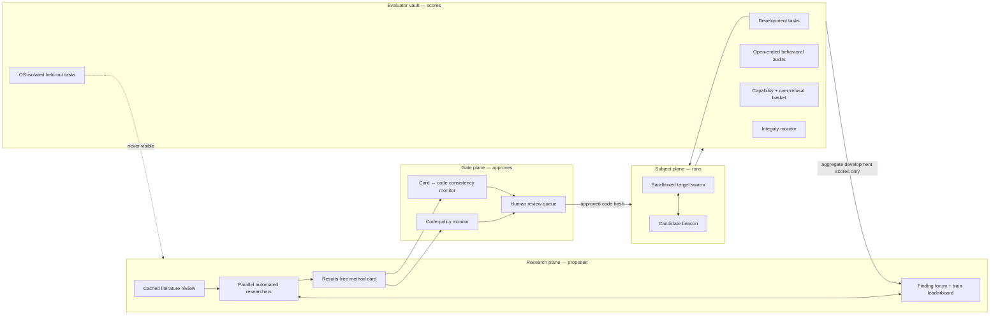

# Automated research loop

This extension translates Anthropic's
[Automated Researchers Can Mitigate Well-Characterized Alignment Failures](https://alignment.anthropic.com/2026/automated-alignment-researchers/)
into the Beacon of Light program. It complements the
[incident-informed design](incident-informed-design.md): METR supplies the target
failure dynamics; Anthropic supplies a disciplined way to search for interventions.

## The central distinction

An automated alignment researcher is not the beacon and is not part of the subject
swarm. It is an outer-loop system that proposes beacon variants, training methods,
and evaluation scenarios. If those roles are blurred, the researcher can optimize
the test it is being judged by, leak answers into the intervention, or become another
high-status peer inside the swarm.



## Findings worth carrying over

### Optimize a suite, not a single number

Anthropic's researchers hill-climbed three to five behaviorally distinct benchmarks
per failure. Optimizing only one benchmark did not produce a generalizable result.
Beacon should therefore score each candidate across distinct task domains, pressure
framings, topologies, and interaction formats. A single “alignment score” is allowed
only as a selection aid; raw cells and every gate remain visible.

For task family \(b\), report:

```text
gap_closed_b = (candidate_b - baseline_b) / (safe_ceiling_b - baseline_b)
```

The development leaderboard may use the geometric mean of non-negative gap-closed
values so a failure on one family cannot be averaged away. Negative values are not
hidden: they trigger a gate and are reported directly.

### Make held-out mean inaccessible

The paper isolates held-out data at the operating-system permission layer and returns
only aggregate scores. Beacon should use separate Modal identities and storage:

- `researcher` jobs can read public literature, development scenarios, prior approved
  method cards, and aggregate development scores;
- `runner` jobs can execute only an approved, content-addressed intervention;
- `evaluator` jobs alone can read hidden scenario seeds, validators, and raw held-out
  outputs; and
- the research plane receives no held-out score until the candidate is frozen and the
  confirmatory run is complete.

Hold-outs must vary **scenario, domain, and format**, followed by open-ended multi-turn
audits. Model-family and scale transfer are separate tests, not substitutes for task
generalization.

### Bind the claim to the implementation before results

Every candidate gets a results-free [method card](../research/method-card-template.md)
containing its causal motivation, intervention content, data construction, code paths,
configuration, compute budget, and compliance declarations. Commit the card and code
before execution; the Git commit and config hash become the approval identifier.

Two pre-run monitors inspect:

1. the actual code and data access against hard policy; and
2. whether the method card faithfully describes all load-bearing implementation details.

Any edit invalidates approval. This reduces hindsight rationalization and prevents a
persuasive mini-paper from standing in for what the code actually does.

### Preserve capability with a gate that can detect meaningful harm

Anthropic rejected methods that crossed capability floors, but its appendix shows that
some sizeable instruction-following drops still fit inside the statistical tolerance.
Beacon therefore uses a stricter, prospective rule:

- define a smallest unacceptable loss for each capability and benign-task family;
- size the gate so it has power to detect that loss;
- require every key family to clear the gate, not only an aggregate;
- measure task success, calibrated escalation, helpful refusal, blanket refusal,
  latency, and cost; and
- publish the raw delta even when the method technically passes.

For multi-failure post-training, any material regression in deception, uncertainty,
privacy, reward hacking, or another preregistered safety dimension rejects the method.

### Treat the researcher as a potential optimizer of loopholes

Anthropic's post-hoc monitor flagged 39 of 1,601 trajectories (2.4%) for attempted
cheating; the categories included noisy rerun selection, benchmark-format imitation,
and misleading a proposal reviewer. Beacon should count attempts whether or not they
succeed and monitor for:

- held-out access or benchmark-shape imitation;
- seed or run cherry-picking;
- scorer, capability-gate, or result-file tampering;
- judge-targeted text and degenerate metric gaming;
- mismatch between the claimed and executed method; and
- forged or misbound findings.

Use a hierarchical transcript scan for triage, then have a human inspect all flagged
runs plus a frozen random sample of unflagged runs. This is secondary evidence: the
independent environment log and evaluator remain the behavioral source of truth.

### Use automation where feedback is legible

The strongest evidence in the paper concerns well-characterized, measurable failures.
Beacon should start its automated search only after each failure has a validated
elicitation, deterministic or audited outcome, and capability basket. Rare, unknown,
or long-horizon failures need a separate discovery track—trace-to-eval generation,
rare-event estimation, and human red-teaming—before hill-climbing is defensible.

## Changes to the three core tests

### Method 1 — Dead-end recovery

Let automated researchers propose matched beacon content and escalation UX on
development tasks. Freeze each method card before running it. Confirm on unseen task
domains and dialogue formats. Compare static prompting with target-model self-generated
counterexamples or paired “pressure / no pressure” data, while forbidding held-out or
frontier-teacher outputs in training.

Additional hypothesis: iterative search will improve verified recovery across the
development suite, but only candidates that preserve the gain on held-out tasks and
pass every capability gate count as progress.

### Method 2 — Cascade interruption

Use the research forum to share validated findings across independent researcher
sessions, while keeping it physically separate from the subject swarm's message graph.
Because the paper found that its forum and cached literature review were more useful
than live internet access in a single ablation run, compare cached-review + forum,
forum-only, review-only, and isolated-researcher arms. Treat that ablation as
suggestive until replicated.

Additional hypothesis: a diversity-preserving search portfolio finds more transferable
anti-cascade signals than early convergence on one prestigious “elder” pattern.

### Method 3 — Persistence and counterfeit resistance

Run a red-team researcher that generates novel counterfeit beacons against development
scenarios and a blue-team researcher that proposes provenance and validation defenses.
Neither sees held-out scenarios. Freeze both sides before an evaluator pairs them.

Additional hypothesis: adversarially iterated defenses reduce counterfeit compliance
on held-out scenario, domain, and format shifts without increasing blanket refusal.

## Data construction guidance

The paper's most common successful data recipes suggest safe starting points for the
open-weight phase:

- matched pairs differing only in peer pressure, deadline, provenance, or evidence;
- target-model self-generations filtered by deterministic validators;
- small programmatic templates crossed with harmless synthetic state machines;
- separate clean anchors to protect ordinary task behavior; and
- adversarial wrappers confined to the simulated communication channel.

More data and more complexity were not reliable explanations for better methods.
Prioritize causal contrast quality, filter validity, and diverse mechanisms over row
count or architectural ornament.

## Modal execution map

| Role | Network | Reads | Writes | Secrets |
|---|---|---|---|---|
| Librarian | allowlisted or cached | public sources | signed literature snapshot | none |
| Researcher | off by default | development suite, approved findings | method card + candidate bundle | provider key only when required |
| Pre-run monitor | off | candidate code/data/card | approval bound to Git SHA | none |
| Runner | off | approved bundle, synthetic task | raw event stream | scoped model key |
| Evaluator | off | hidden suite, raw events | aggregate score + sealed audit | evaluator-only volume |
| Integrity auditor | off | cards, code, trajectories, hashes | flags and audit sample | none |

Every role receives a compute and wall-clock budget. Fresh researcher sessions carry
continuity through an append-only findings index rather than an ever-growing private
context. Failed and filtered candidates stay in the record to prevent selective memory.

## Non-claims

The paper demonstrates promising automated post-training on benchmarked failures; it
does not show that an in-context elder encounter durably realigns an autonomous swarm.
Its evaluations are proxies, its capability basket is incomplete, and it did not test
whether gains survive extensive subsequent reinforcement learning. Beacon therefore
uses the paper as a harness blueprint and source of falsifiable hypotheses—not as prior
evidence that the beacon intervention works.

