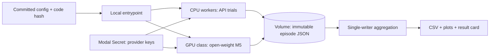

# Modal execution

GPT-6 Astra is a hosted API model, so Astra experiments need Modal CPU orchestration rather than a Modal GPU. GPUs are reserved for M5 open-weight inference, activation extraction, and steering.

## Resource layout



- `beacon-api-keys`: environment-scoped Modal Secret with provider keys.
- `beacon-results-v2`: Volume v2 with one immutable file per episode.
- `beacon-hf-cache`: separate Volume for pinned open-weight model revisions.
- CPU workers: hosted API calls, deterministic simulation, and scoring.
- GPU workers: opt-in L40S/A100 open-weight experiments only.

Do not let workers append to one JSONL or SQLite file. Derive an idempotent episode ID from the canonical config, seed, and code version, then write a distinct `episodes/<id>.json` file. A single aggregation job combines shards. This avoids last-write-wins corruption and makes retries auditable.

## Local and smoke commands

```powershell
python -m pip install -e ".[dev,modal,providers]"
modal setup
modal environment create dev
modal secret create beacon-api-keys OPENAI_API_KEY="$env:OPENAI_API_KEY" --env=dev
modal volume create beacon-results-v2 --version=2 --env=dev
beacon run --config configs/smoke.toml --out runs/smoke
modal run --env=dev -m beacon_of_light.modal_app --config configs/smoke.toml
```

Start with the fake/provider-free smoke run. Make the first paid model episode explicit, record the response and returned model IDs, and cap output tokens, retries, containers, and total episode count.

## Reproducibility and cost

- Pin package and open-weight model revisions for confirmatory runs.
- Put stable dependencies before local source in the Modal Image for efficient layer caching.
- Use long invariant prompt prefixes and short per-turn suffixes for provider prompt caching.
- Never reuse a stochastic sample across replicate indices; resume only the same episode/turn after infrastructure failure.
- Log provider usage, latency, retry count, result hash, config hash, and Git SHA.
- Configure Modal environment budgets before a full sweep.
- A provider model update ends that cohort; start a labeled replication.

## Official documentation

- [Modal Functions and App](https://modal.com/docs/sdk/py/latest/App)
- [Function map/starmap](https://modal.com/docs/guide/function-invocation-methods)
- [Secrets](https://modal.com/docs/guide/secrets)
- [Volumes](https://modal.com/docs/guide/volumes)
- [Images and local source](https://modal.com/docs/guide/images)
- [GPU acceleration](https://modal.com/docs/guide/gpu)
- [GPT-6 Astra model page](https://developers.openai.com/api/docs/models/gpt-6-astra)
- [GPT-6 Astra model guidance](https://developers.openai.com/api/docs/guides/latest-model)

